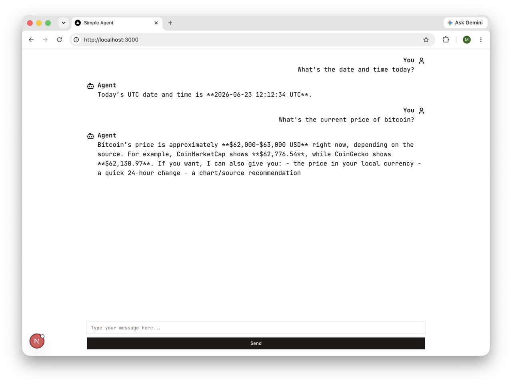

# Simple Agent

A minimal example project containing a simple Langgraph agent implementation and a Next.js web frontend.



## Overview

This repository demonstrates a simple agent architecture (in the `agent/` folder) alongside a web UI (in the `web/` folder). It includes tests for the Python agent and basic components for the frontend.

## Requirements

- Python 3.11+ (for the agent)
- pip or uv for Python package management
- Node.js 18+ (for the web frontend)
- pnpm or npm for JavaScript package management

## Install

Python (agent):

```bash
cd agent
uv sync # or `pip install -r requirements.txt` if you don't use uv
```

Web frontend:

```bash
cd web
pnpm install   # or `npm install` if you don't use pnpm
```

## Run

Run the agent (from the `agent` folder):

```bash
cd agent
uv run lanngraph dev  # or `python -m lanngraph dev` if you don't use uv
```

Run the frontend (from the `web` folder):

```bash
cd web
pnpm dev       # or `npm run dev`
```

## Project structure

- `agent/` — Python agent source and configuration
- `web/` — Next.js frontend and components

## Contributing

Contributions welcome. Open an issue or create a pull request with a clear description of changes.

## License

This project is provided as-is. Add a license file if you wish to clarify usage terms.

